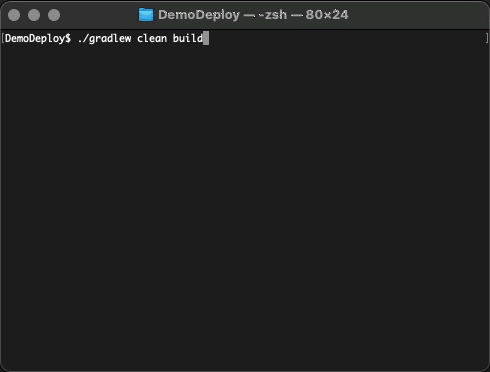

# Demo repo showing how to use web3j-deployer

The library [web3j-deployer](https://github.com/web3j/web3j-deployer) and Gradle
plugin [web3j-deployer-plugin](https://github.com/web3j/web3j-deployer-plugin) allows you to define your deployment
routine for your smart contracts using [Web3j](https://github.com/web3j/web3j). It's an annotation driven approach, with
two key annotations used, as shown in
the [MyDeploymentLogic](https://github.com/web3j/web3j-deployer-demo/blob/master/src/main/java/demo/deploy/MyDeploymentLogic.java)
source file.

To build the wrapper code for the
included [HelloWorld.sol](https://github.com/web3j/web3j-deployer-demo/blob/master/src/main/solidity/HelloWorld.sol)
smart contract, use the usual gradle commands:

`./gradlew clean build`

Thereafter, to run the deployment logic use the gradle deploy command, specifying the profile and package as needed:

`./gradlew -q deploy -Pprofile=rinkeby1 -Ppackage=demo.deploy`

